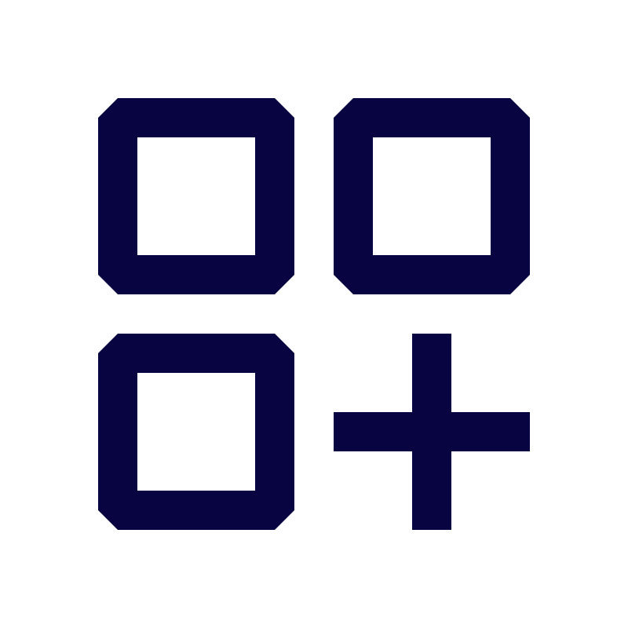

# Hi, I'm Xabi 👋

I'm a backend developer with experience in TODO...

## 🛠️ Skills and Tools

### 💻 Programming Languages: 

###  Frameworks:

###   Web Development:

###  Operating systems: 

###  Database: 

###  Version Control: 

###  Others: 

## 🌱 I’m currently working

- TODO: In proces...

## 📫 How to reach me

## ⚡ Fun fact

- I love playing 🏀basketball and ♟️chess in my free time.
- If I'm not surfing the internet, I'm probably camping in the mountains for a night of stargazing 🔭
