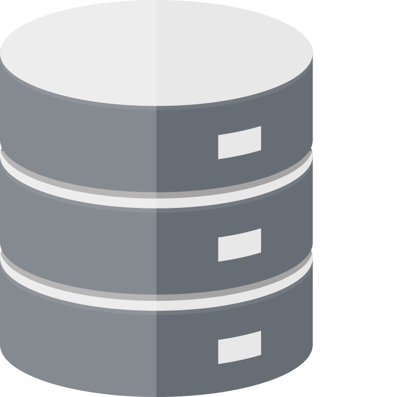

  

I'm Full Stack Software Developer (though I have a particular passion for backend). I have been involved in various projects, including GIS development, ERPs, Web, Mobile, and Desktop applications.

I've been involved in several development projects including GIS, ERPs, mobile, web and desktop applications. You can find some of these projects below.

If you have any questions, or want to talk to me, feel free to contact me!

## 🛠️ Skills and Tools

### 💻 Programming Languages:

###  Frameworks:

###   Web Development:

###  Database: 

###  Version Control:

### 🗺️ GIS (Geographical Information Systems)

### 🐧 Operative Systems

###  Others: 

## 📈 Statistics

  

  

## 🌱 I’m currently working

I am currently working for the government of Navarra as a Full Stack Developer, at Tracasa Instrumental, where I'm engaged in developing GIS (Geographic Information Systems) applications. In my daily work, I use technologies like ASP.NET Core and Entity Framework to build a solid and scalable architecture; React.js to implement attractive and functional user interfaces; and PostgreSQL for data persistence, among other tools.

## 📫 How to reach me

  
  

## ⚡ Fun fact

- If I'm not surfing the internet, I'm probably camping ⛺️ in the mountains for a night of stargazing 🔭
- I love hiking and taking the chance to get away from the city whenever I can 🗻
- I love playing 🏀basketball and ♟️chess in my free time.
